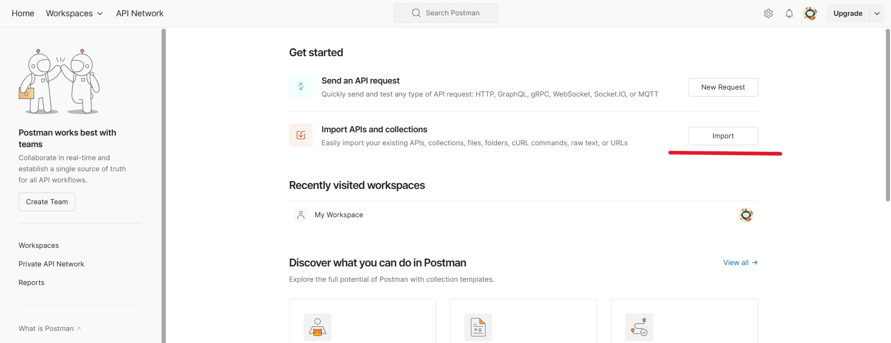

1. Go to Postman using the provided link(https://www.postman.com/).
2. Click on Import in the Postman interface.
   
3. Select the option to upload a file.
   
4. Locate the desired file using the path:
   car-sharing\src\main\resources\car_sharing.postman_collection.json