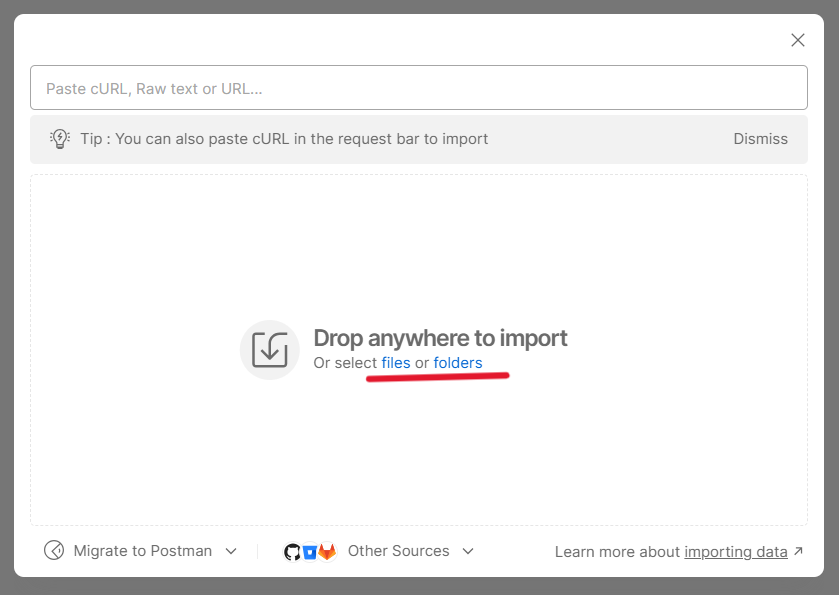

## Table of Contents
1. [Project Overview](#project-overview)
2. [Requirements](#requirements)
3. [How to Run](#how-to-run)
4. [Key Features](#key-features)
5. [Technology used](#technology-used)
6. [Postman and Swagger](#postman-and-swagger)
7. [Database Schema and Relationships](#database-schema-and-relationships)
8. [Docker setup](#docker-setup)

---

## Project Overview
**Car Sharing API** is a RESTful web application designed to manage an online car sharing. It provides basic features like:
- Viewing the catalog of cars.
- Creating payment sessions.
- Renting cars.
- Managing user roles (Admin/User).

This project is built using Spring Boot and uses MySQL as the database for storing data.

---

## Requirements
- **Java** 17 or later
- **Maven** 3.6 or later
- **MySQL** 8.0 or later
- **Postman** (optional, for API testing)

---

## How to Run

1. **Clone the repository**  
   Download the project using the following command:
   ```bash
   git clone https://github.com/layzimayner/car-sharing.git

2. **Navigate to the project directory**
   ```bash
   cd car-sharing

3. **Install dependencies**
   ```bash
   mvn clean install

4. **Add configuration**
   Add an application.properties file to the src/main/resources directory with the following settings:
   

5. **Run the project**
   ```bash
   mvn spring-boot:run

---

## Key Features
1. User Management:
   Users can register and  log in, update profile or roles.
2. Car Management:
   Create, update, delete and find car from DB.
3. Rentals Management:
   Create, close and find active or all.
4. Payment Management:
   Create session, renew session and find payments.

---

## Technology used
The project is built on Spring, with the addition of Boot, Security, and Data JPA,
aimed at reducing boilerplate code and simplifying testing. To ensure the security
of all sensitive data and maintain the stateless nature of the application,
I implemented JWT tokens .Here is the entire list of frameworks/libraries:

Core Technologies:
1. Spring Boot 3.3.4 :
* spring-boot-starter-web
* spring-boot-starter-data-jpa
* spring-boot-starter-security
* spring-boot-starter-test
* spring-boot-maven-plugin

2. Databases:
* liquibase-core Inherited from Spring Boot Parent
* mysql-connector-j 8.0.33
* h2 Inherited from Spring Boot Parent

3. Validation:
* hibernate-validator 8.0.1.Final

4. Security:
* jjwt (JSON Web Token) 0.11.5
* spring-security-test Inherited from Spring Boot Parent

5. Mapping:
* MapStruct 1.5.5.Final
* Lombok MapStruct Binding: 0.2.0

6. Documentation:
* springdoc-openapi-starter-webmvc-ui 2.6.0

7. Testing:
* Testcontainers 1.18.0
* JUnit Jupiter 5.10.0

8. Tools:
* maven-compiler-plugin Uses Java version 17 from <java.version> property.
* maven-checkstyle-plugin 3.3.0

9. Payment integration
* stripe-java 3.3.0 

---

## Postman and Swagger

The inclusion of Swagger provides the ability to interactively
test how the application works(http://localhost:8080/swagger-ui.html). You can create a new user
without administrator rights, or use an existing one with extended rights or not
(email = admin@example.com, password = admin; email = user@exampl.com, password = user).
Also, use the user's data in Postman.Here are the instructions for importing a Postman collection:

1. Go to Postman using the provided link(https://www.postman.com/).
2. Click on Import in the Postman interface.
   
3. Select the option to upload a file.
   
4. Locate the desired file using the path:
   car-sharing\src\main\resources\car_sharing.postman_collection.json

In addition to standard controller endpoints like delete, create, update, find by ID, and get all,
the project also includes publicly accessible endpoints such as:

* POST auth/login, POST auth/register and GET cars

More specific endpoints include:

* GET rentals:
  Returns the rental page with only active rentals upon request.
  Additionally, the admin can view other rentals if needed.

* PUT orders/{paymentId}
  Create new session for expired payment.

---

## Database Schema and Relationships


---

## Docker setup

1. Make sure you download Docker and Docker plugin

2. Create env. file in project folder, with next fields:
* MYSQLDB_DATABASE - Enter the name of your MySQL database.

  Example: my_database
* MYSQLDB_ROOT_PASSWORD - Enter the root password for your MySQL database.

  Example: rootpassword123
* MYSQLDB_USER Specify - the username for connecting to the database.

  Example: db_user
* DB_URL_ADDRESS - Provide the URL or IP address of the database server.

  Example: jdbc:mysql://localhost:3306/book_store
* MYSQLDB_LOCAL_PORT Specify the port on your local machine for MySQL.

  Example: 3306
* MYSQLDB_DOCKER_PORT - Specify the port inside the Docker container for MySQL.

  Example: 3306
* SPRING_LOCAL_PORT - Set the local port where your Spring Boot application will run.

  Example: 8080
* SPRING_DOCKER_PORT - Set the Docker container port for your Spring Boot application.

  Example: 8080
* DEBUG_PORT - Specify the port for debugging purposes.

  Example: 5050

3. Launch docker-compose
   ```bash
   docker-compose up --build

---

This is my second independent project. The process raised many questions and challenges,
especially during the testing phase, but I am satisfied with the result.
I believe it still needs improvement and is probably far from being ready for the real world.
Nevertheless, this project went a bit deeper than the previous one


